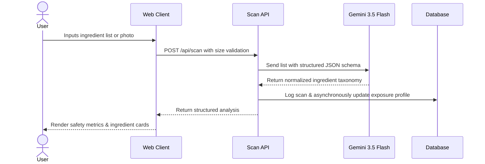

# Decode

Decode is a technical engine and web interface for parsing, normalizing, and analyzing ingredient labels from foods, beverages, and pharmaceuticals. It leverages generative AI to identify additives, evaluate chemical safety, and track cumulative compound exposure over time.

## System Architecture



## Tech Stack

*   **Core Framework**: Next.js 16 (App Router), React 19, TypeScript
*   **Database**: Prisma ORM with PostgreSQL
*   **Authentication**: Supabase Auth (@supabase/ssr)
*   **AI Integration**: @google/genai Interactions API (Gemini 3.5 Flash)
*   **Styling & Motion**: Tailwind CSS, Framer Motion

## Local Development

### 1. Installation
Clone the repository and install dependencies using Bun:
```bash
git clone https://github.com/your-username/decode.git
cd decode
bun install
```

### 2. Environment Variables
Create a `.env` file in the root directory:
```env
DATABASE_URL="postgresql://<user>:<password>@localhost:5432/<db_name>?schema=public"

NEXT_PUBLIC_SUPABASE_URL="https://<project>.supabase.co"
NEXT_PUBLIC_SUPABASE_ANON_KEY="<anon_key>"
SUPABASE_SERVICE_ROLE_KEY="<service_role_key>"

GEMINI_API_KEY="<gemini_api_key>"
```

### 3. Database Setup
Initialize the database schema and generate the Prisma Client:
```bash
bunx prisma db push
bunx prisma generate
```

### 4. Run Application
Start the Next.js development server:
```bash
bun run dev
```

## Production & Build Scripts

| Command | Action |
| :--- | :--- |
| `bun run dev` | Runs local development server |
| `bun run build` | Builds production-optimized Next.js bundle |
| `bun run start` | Serves production build |
| `bun run lint` | Runs ESLint checks |

## Security & API Controls

*   **Input Sanitization**: Requests to `/api/scan` are restricted to a maximum of 5,000 characters to prevent payload injection and DoS.
*   **Parameter Allowlisting**: The API enforces strict allowlists on `inputType` (`'text'`, `'product_name'`, `'photo'`).
*   **HTTP Security Headers**: Implemented via `next.config.ts`:
    *   `X-Frame-Options: DENY` (prevents clickjacking)
    *   `X-Content-Type-Options: nosniff` (prevents MIME-sniffing)
    *   `Referrer-Policy: origin-when-cross-origin`
    *   `X-XSS-Protection: 1; mode=block`
